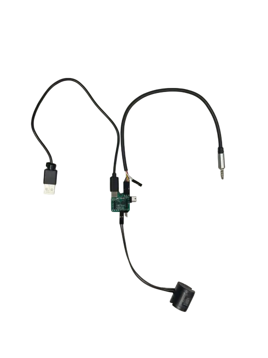
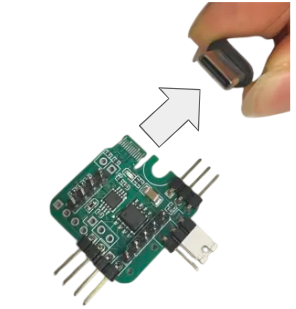
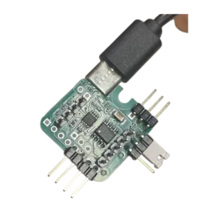
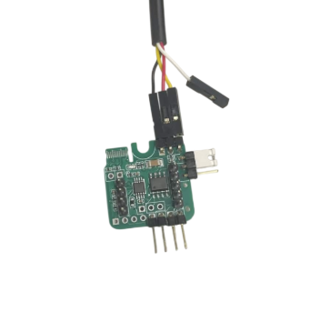
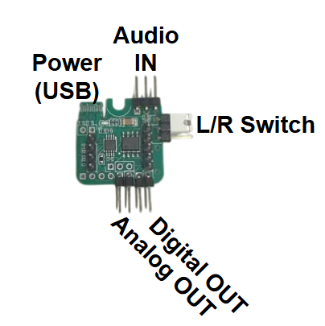
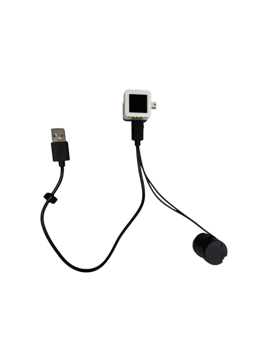

# duchap
duchap 触覚再現モジュールは、Foster社製の触覚アクチュエーターを駆動するためのモジュールです。
アナログ入力とマイコンによるデジタル制御の両方に対応しており、用途に応じた柔軟な運用が可能です。
従来は別構成となることが多いアナログ駆動系とデジタル制御系を1枚の基板に統合している点が特徴です。
触覚提示や振動提示の実験・試作を行いたい方に向けたモジュールです。

- Foster社製触覚アクチュエーターの駆動に対応
- アナログ入力による駆動に対応
- マイコン等からのデジタル制御に対応
- アナログ駆動系とデジタル制御系を1枚の基板に統合
- 触覚提示システムの試作・研究用途を想定

- アナログ駆動とデジタル制御の両方に対応
- 小型で実験系へ組み込みやすい
- 組み立て済みでアクチュエーターを同梱しており到着後すぐテストが可能

## Analog版使用方法
TypeCケーブルを挿し，オーディオジャックから再生

### 参考動画
https://youtu.be/OYqQZCnmybw

https://youtu.be/dnwXpK6lNK8

#### 配線

#### 電源のUSBCの接続

#### オーディオケーブルの接続

#### アクチュエーターは下図を参考に接続(Digital/Analog)

## デジタル版使用方法
platformioでAtomS3に書き込み

#### 配線

#### アクチュエーターは下図を参考に接続(Digital/Analog)

### 環境
* ArduinoIDE2.0
* hapstakモジュール
* M5SAtomS3

### 機能
* 画面裏のボタンでサンプル遷移
* 一定以上の加速度でサンプル動作

## 注意点
* AtomS3は画面裏にボタンがあります
